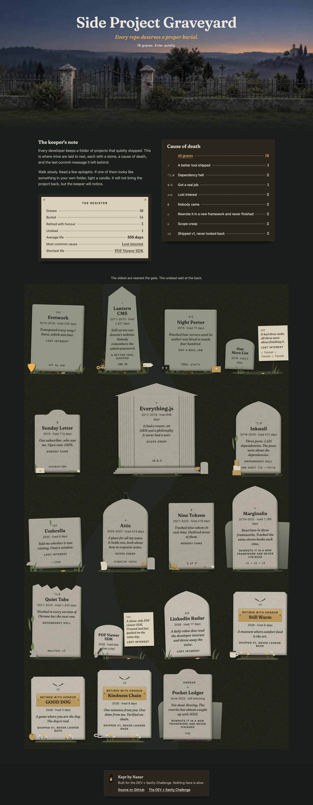
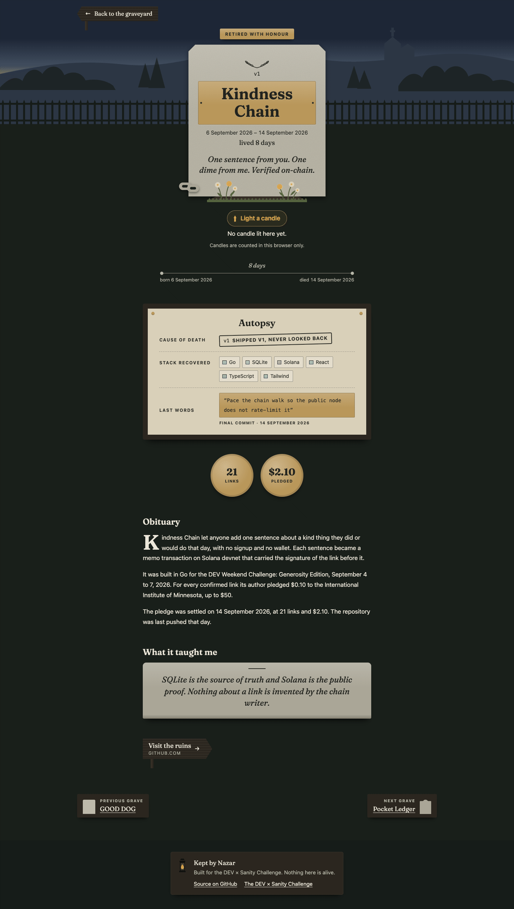
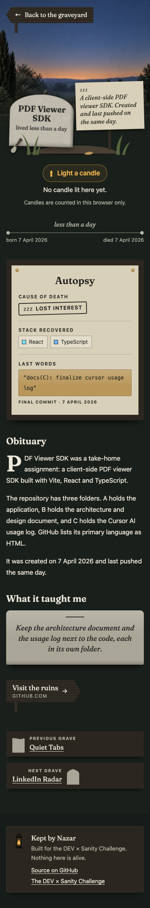
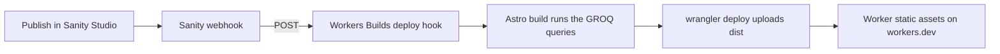

# Side Project Graveyard

Every repo deserves a proper burial.

I have a folder of side projects that stopped. This site gives each of them a stone: an epitaph, a cause of death, the stack it was built with, its last commit message, and the one thing it taught me. The content lives in Sanity, the site is Astro, and I built it for the DEV × Sanity Challenge by prompting Claude Code.

- Live site: https://side-project-graveyard.boyko-nazar.workers.dev
- Studio: https://side-project-graveyard.sanity.studio
- Sanity project ID `20pcz8by`, dataset `production` (public)
- Build log, with every prompt and every failure: [docs/BUILD_LOG.md](docs/BUILD_LOG.md)

<table>
  <tr>
    <td></td>
    <td></td>
    <td></td>
  </tr>
</table>

All six screenshots, at 1440, 768 and 390 pixels, are in [docs/screenshots](docs/screenshots).

## Content model

Four document types, defined in [`studio/schemaTypes/`](studio/schemaTypes).

| Type | What it is | Fields |
|---|---|---|
| `project` | A grave | name, slug, epitaph, status (buried, retired, undead), born and died dates, cause, stack, last commit, mood at death, lines of code, obituary, lesson, repository, and an optional `monument`: shape, relic, inscription, figures |
| `cause` | A cause of death | title, slug, one-sentence description, an icon of four characters at most, the mark it leaves on the plot (`motif`) |
| `tech` | Something a project was built with | name, slug, chip colour |
| `siteSettings` | The gate | title, tagline, intro, keeper, footer line. One document with a fixed ID |

A grave points to its cause and its stack by reference. I could have typed "Lost interest" into a string field five times. With references the site can count: the most common cause of death, the graves per cause, the graves per tool. Nobody types the numbers in the stats row. Astro computes them from the documents during the build, in [`web/src/lib/stats.ts`](web/src/lib/stats.ts).

The validation rules follow what the page needs:

- A project cannot die before it is born.
- Only the undead may go without a date of death.
- An epitaph longer than 120 characters will not fit on the stone.
- A stack has one to eight tools, each listed once.

The settings document is a singleton. The Studio opens it from the desk and offers no way to create a second one or delete the first.

## The stone is computed from the record

No grave has its own artwork, and no line of the site's code names a grave. Each stone is worked out from its record in [`web/src/lib/monument.ts`](web/src/lib/monument.ts), and a grave created in the Studio gets a complete monument on the next publish.

| What you see | Where it comes from |
|---|---|
| Height of the stone | Born and died dates, on a log scale. A project that lived no days is the smallest stone in the yard. |
| Grass, moss, stains, cracks | Years since the date of death, at build time: fresh, settled, aged, ancient. The undead get disturbed soil and a slow green light. |
| Weeds, laurel, older slabs, an annex, a signpost, a briefcase, a vine, an empty plot | The cause's `motif`. |
| Brass plaque and flowers, or a low marker with a wooden tag | The status, and a lifespan under a week. |
| Silhouette | `monument.shape` if the editor set one, otherwise the status, the lifespan and a hash of the slug. |
| The object left at the grave | `monument.relic`. |
| The small carving near the base | `monument.inscription`. |
| Brass medallions on the grave page | `monument.figures`, at most three. |
| Tilt and small offsets | A hash of the slug. Never random. |
| The cat | Sits on the grave published most recently, so it moves when the keeper publishes. |

The redesign was planned in [docs/DESIGN_BRIEF.md](docs/DESIGN_BRIEF.md).

## How a publish becomes a deploy

The site is static. It runs as a Cloudflare Worker that has no script, only static assets: the files Astro writes to `web/dist`. Workers Builds is connected to this repo and deploys every push to `main`.

| Workers Builds setting | Value |
|---|---|
| Root directory | `web` |
| Build command | `npm run build` |
| Deploy command | `npx wrangler deploy` |
| Build variables | `PUBLIC_SANITY_PROJECT_ID`, `PUBLIC_SANITY_DATASET=production`, `SITE_URL`, Node 22 |
| Worker config | [`web/wrangler.jsonc`](web/wrangler.jsonc): assets from `./dist`, unknown paths get `404.html` |

Nothing is fetched in the browser. The GROQ queries run once, during the build, so a change in the Studio needs a new build. A webhook takes care of that:



The webhook listens to the `production` dataset for create, update and delete, and sends a POST to the deploy hook. Its filter keeps drafts from triggering builds:

```groq
_type in ["project","cause","tech","siteSettings"] && !(_id in path("drafts.**"))
```

I measured it: a published change was on the live site between 30 and 60 seconds later.

The deploy hook URL is a secret. It lives in the Sanity webhook settings and in a local `.env`, never in this repo.

The Studio is deployed on its own with `cd studio && npx sanity deploy`.

`studio/scripts/touch-settings.ts` tests the chain without opening the Studio. It stamps the footer line, and the live site shows the stamp after the rebuild:

```bash
cd studio
npx sanity exec scripts/touch-settings.ts --with-user-token -- touch
npx sanity exec scripts/touch-settings.ts --with-user-token -- restore
```

## Run it locally

You need Node 22 and npm.

The Studio, on http://localhost:3333:

```bash
cd studio
npm install
npm run dev
```

The site, on http://localhost:4321:

```bash
cd web
npm install
printf 'PUBLIC_SANITY_PROJECT_ID=20pcz8by\nPUBLIC_SANITY_DATASET=production\n' > .env
npm run dev
```

The dataset is public, so the site builds without a token.

To fill a Sanity project of your own with the seed content, put its project ID in `studio/sanity.config.ts` and `studio/sanity.cli.ts`, then:

```bash
cd studio
npx sanity datasets import seed/graveyard.ndjson -d production --replace
```

The checks CI runs on every pull request:

```bash
cd web && npx astro check && npm test && npm run build
cd studio && npx tsc --noEmit && npx sanity schema validate
```

## What is real and what is not

Five graves are public repositories of mine, described from their GitHub metadata and READMEs. The other 13 are invented from familiar types: the todo app, the framework to end all frameworks, the newsletter with one subscriber. The stats count all 18.

Candles are counted in your browser only. Nothing is sent anywhere. A grave you lit a candle for shows it in the yard too, on this device.

## Built with Claude Code

I typed one kickoff prompt. The prompts for the eight phases were written in advance in a local plan, and the model read them from there: one branch and one pull request per phase, merged after CI went green. [docs/BUILD_LOG.md](docs/BUILD_LOG.md) has each prompt verbatim, what came out, what failed, and what the model decided on its own.

The site then worked and looked like a dark dashboard. I had two outside design reviews done, checked them against the code and the data, and wrote the result up as [docs/DESIGN_BRIEF.md](docs/DESIGN_BRIEF.md). The redesign ran as five more branches. For the two visual ones the model stopped at an open pull request and waited for me to look. Every visual change went through at least three rounds of screenshots, taken with Playwright and read by the model, and the log lists every drawing that needed a redo.

The session rules are in [CLAUDE.md](CLAUDE.md). The session also used a handful of my own skills as guard rails:

- a voice guide for the copy, written for this project and kept in [`.claude/skills/graveyard-voice`](.claude/skills/graveyard-voice/SKILL.md)
- an accessibility checklist
- two review checklists, one for the interface and one for the audience
- commit rules and testing rules
- post-style rules for the writeup

## Credits

- [Sanity Studio](https://www.sanity.io/studio), scaffolded with `npm create sanity@latest` (clean TypeScript template)
- [Astro](https://astro.build), scaffolded with `npm create astro@latest` (minimal template)
- [@sanity/astro](https://github.com/sanity-io/sanity-astro), the Sanity client inside the Astro build
- [astro-portabletext](https://github.com/theisel/astro-portabletext), renders the obituaries
- [Vitest](https://vitest.dev), runs the tests for the date and stats maths
- [sharp](https://sharp.pixelplumbing.com), draws the social card once, from an SVG in `web/scripts/og.mjs`
- [Wrangler](https://developers.cloudflare.com/workers/wrangler/), deploys the built files as Cloudflare Worker static assets
- [Fraunces](https://github.com/undercasetype/Fraunces) by Undercase Type, SIL Open Font License 1.1, self-hosted from [@fontsource-variable/fraunces](https://fontsource.org/fonts/fraunces): the title, names, epitaphs and headings. Everything else uses the fonts already on your device.
- [Playwright](https://playwright.dev) and [Lighthouse](https://developer.chrome.com/docs/lighthouse), run with `npx` during the build: the screenshots in `docs/screenshots` and the performance and accessibility numbers in the build log. Neither is a dependency of the site.

## License

MIT
