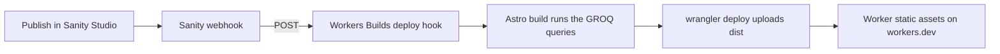

# Side Project Graveyard

Every repo deserves a proper burial.

A quiet cemetery for abandoned side projects. Each one gets an epitaph, a cause of death, and the one thing it taught me.
Content lives in Sanity, the site is Astro. Built for the DEV × Sanity Challenge by prompting Claude Code; the prompt log is in [docs/BUILD_LOG.md](docs/BUILD_LOG.md).
The gates are not open yet. This file grows as the build does.

## Deploy

The site is static. It runs as a Cloudflare Worker that has no script, only static assets: the files Astro writes to `web/dist`. Workers Builds is connected to this repo and deploys every push to `main`.

| Workers Builds setting | Value |
|---|---|
| Root directory | `web` |
| Build command | `npm run build` |
| Deploy command | `npx wrangler deploy` |
| Build variables | `PUBLIC_SANITY_PROJECT_ID`, `PUBLIC_SANITY_DATASET=production`, `SITE_URL`, Node 22 |
| Worker config | [`web/wrangler.jsonc`](web/wrangler.jsonc): assets from `./dist`, unknown paths get `404.html` |

Nothing is fetched in the browser. The GROQ queries run once, during the build, so a change in the Studio needs a new build. A webhook takes care of that:



The webhook listens to the `production` dataset for create, update and delete, and sends a POST to the deploy hook. Its filter keeps drafts from triggering builds:

```groq
_type in ["project","cause","tech","siteSettings"] && !(_id in path("drafts.**"))
```

The deploy hook URL is a secret. It lives in the Sanity webhook settings and in a local `.env`, never in this repo.

The Studio is deployed on its own with `cd studio && npx sanity deploy`, to https://side-project-graveyard.sanity.studio.

`studio/scripts/touch-settings.ts` tests the chain without opening the Studio: it stamps the footer line, and the live site should show the stamp a few minutes later.

```bash
cd studio
npx sanity exec scripts/touch-settings.ts --with-user-token -- touch
npx sanity exec scripts/touch-settings.ts --with-user-token -- restore
```

## Credits

- [Sanity Studio](https://www.sanity.io/studio), scaffolded with `npm create sanity@latest` (clean TypeScript template)
- [Astro](https://astro.build), scaffolded with `npm create astro@latest` (minimal template)
- [@sanity/astro](https://github.com/sanity-io/sanity-astro), the Sanity client inside the Astro build
- [astro-portabletext](https://github.com/theisel/astro-portabletext), renders the obituaries
- [Vitest](https://vitest.dev), runs the tests for the date and stats maths
- [sharp](https://sharp.pixelplumbing.com), draws the social card once, from an SVG in `web/scripts/og.mjs`
- [Wrangler](https://developers.cloudflare.com/workers/wrangler/), deploys the built files as Cloudflare Worker static assets

## License

MIT
